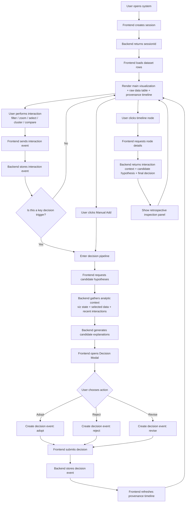

```mermaid
flowchart TD
    A[User opens system] --> B[Frontend creates session]
    B --> C[Backend returns sessionId]
    C --> D[Frontend loads dataset rows]
    D --> E[Render main visualization + raw data table + provenance timeline]

    %% Exploration path
    E --> F[User performs interaction<br/>filter / zoom / select / cluster / compare]
    F --> G[Frontend sends interaction event]
    G --> H[Backend stores interaction event]
    H --> I{Is this a key decision trigger?}
    I -- No --> E
    I -- Yes --> J[Enter decision pipeline]

    %% Manual add path
    E --> K[User clicks Manual Add]
    K --> J

    %% Shared decision pipeline
    J --> L[Frontend requests candidate hypotheses]
    L --> M[Backend gathers analytic context<br/>viz state + selected data + recent interactions]
    M --> N[Backend generates candidate explanations]
    N --> O[Frontend opens Decision Modal]

    O --> P{User chooses action}
    P -- Adopt --> Q[Create decision event: adopt]
    P -- Reject --> R[Create decision event: reject]
    P -- Revise --> S[Create decision event: revise]

    Q --> T[Frontend submits decision]
    R --> T
    S --> T
    T --> U[Backend stores decision event]
    U --> V[Frontend refreshes provenance timeline]
    V --> E

    %% Timeline inspection can happen anytime
    E --> W[User clicks timeline node]
    W --> X[Frontend requests node details]
    X --> Y[Backend returns interaction context + candidate hypothesis + final decision]
    Y --> Z[Show retrospective inspection panel]
    Z --> E
```
